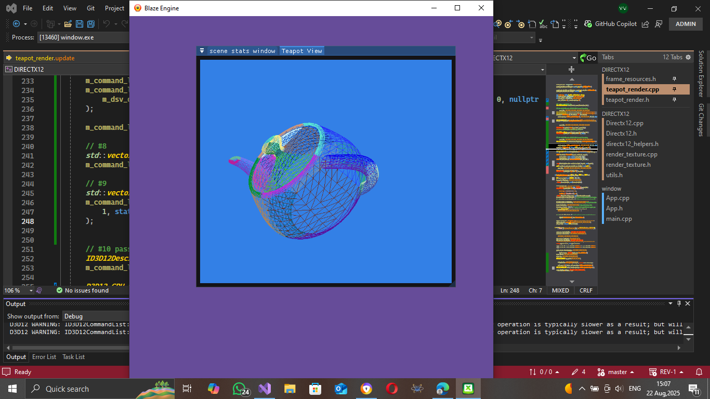
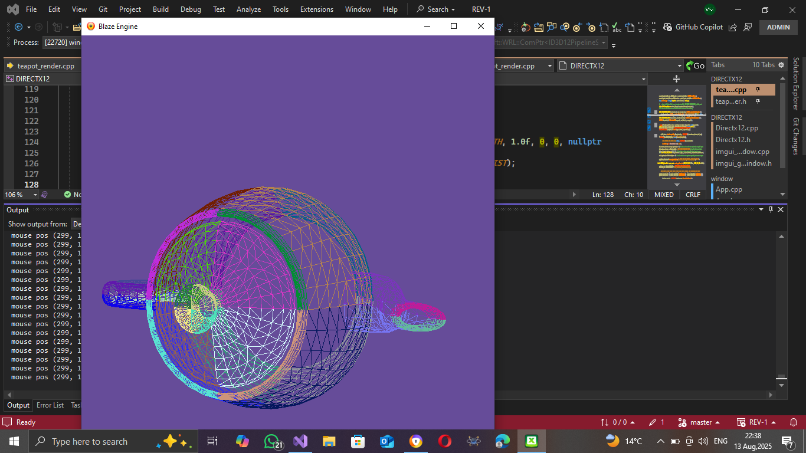
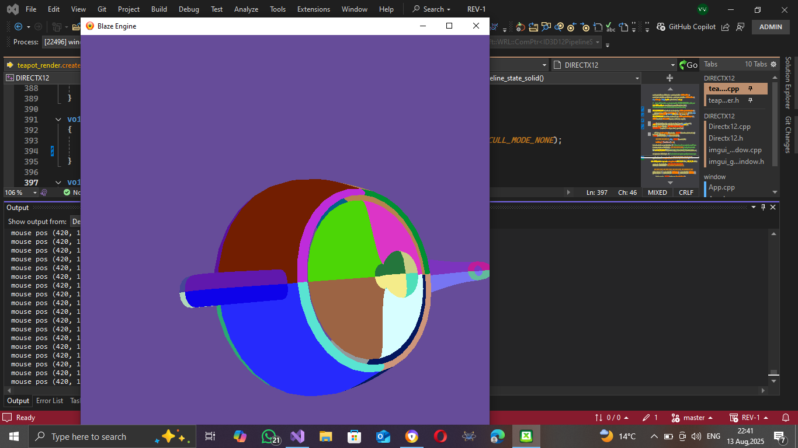

HELLO THERE WELLCOME TO MY DIRECTX12 REPOSITORY 
In here i take you through how i am learning directx12
> what i will be doing 
- making a class that manages offscreen render targets for the 3d scene, enabling me to resize them dynamically.
- design the scene view the object editor and scene hierarchy.
- add circular resource arrays to optimise the rendering process e.g. increase the number of frames per second.
- continue on reading frank luna's introduction to direct3d12
- add an object loader e.g. tiny object loader or assimp
- add a texture/image loader.
- for now the goal is to create a small engine that loads 3d objects and does simple edditing.

for starters the sample images below show the teapot that i drew using 16 point control patches, in both wire frame and solid.

> Current Features.
- It has support for toggling v-sync on and off to increase the frame rate.
- Supports full screen rendering.
- Supports offscreen render targets.

> ## SAMPLES OF OFFSCREEN RENDER TARGETS.


> ## SAMPLE WIRE-FRAME


> ## SAMPLE-SOLID


THE PROCESS<br>
```+-----------------------------+
| Initialization             |
| - Device, Swap Chain       |
| - Command Queue            |
| - Descriptor Heaps         |
| - Root Signature & PSO     |
| - Resource Uploads         |
+-----------------------------+

+-----------------------------+
| Frame Resources (per-frame)|
| - Command Allocator        |
| - Command List             |
| - Constant Buffers         |
| - Fence & Sync             |
+-----------------------------+

+-----------------------------+
| Scene Graph / ECS          |
| - Entities & Components    |
| - Transform Hierarchy      |
| - Material & Mesh Systems  |
+-----------------------------+

+-----------------------------+
| Render Loop                |
| - Update Logic             |
| - Record Command List      |
| - Resource Binding         |
| - Draw Calls               |
| - Execute & Present        |
+-----------------------------+
```
