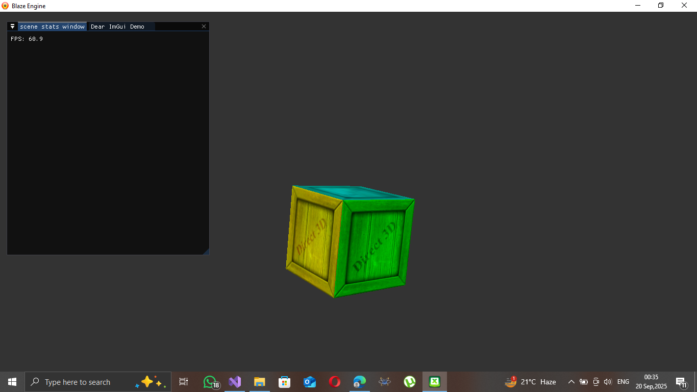

# CURRENT ROADMAP 
- Add texture mapping.
- Add ligting.
- Add a basic camera.
- model loading.
- depth testing.
- PBR.
  
> ## SAMPLES OF THE TEXTURE MAPPED CUBE.

_To achieve the above effect_
```
  Texture2D t1 : register(t0);
  SamplerState s1 : register(s0);
  
  struct pixel_shader_input
  {
      float4 position : SV_Position;
      float4 color : COLOR;
      float2 uv_coords : TEXCOORD;
  };
  
  float4 main(pixel_shader_input input) : SV_TARGET
  {
      // multiply the sampled texture by the input color from the VERTEX structure.
      return t1.Sample(s1, input.uv_coords) * input.color;
  }
```
